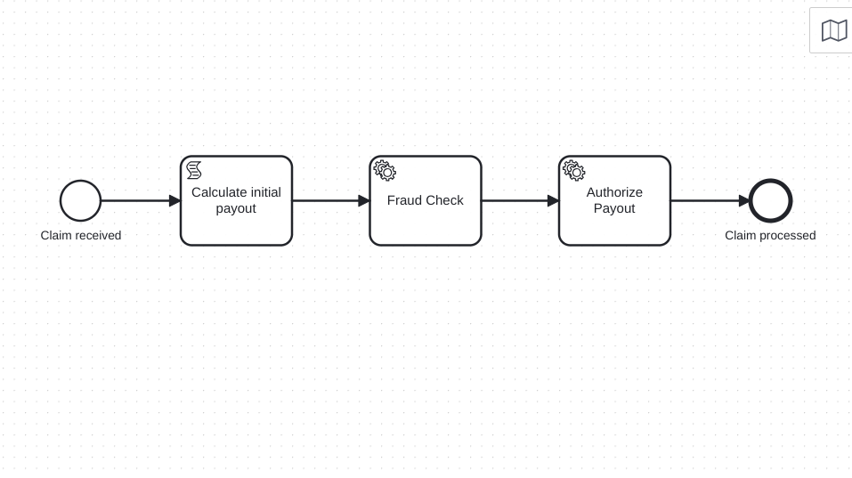

# camunda-zeebe-insurance-claim

This is a simple project demonstrating an insurance claim evaluation process using Camunda 8 (Zeebe) and Java workers.

## Overview

The project consists of:

- A BPMN process model `insurance-claim-evaluation.bpmn`
- A Spring Boot application with Zeebe workers to handle service tasks:
    - `fraud-check`
    - `authorize-payout`

The process flow is:
1. Receive a new insurance claim
2. Calculate an initial payout amount based on severity
3. Perform a fraud check
4. Authorize the payout if fraud check passes
5. Finish the claim process

## BPMN Diagram

The process includes:

- **Start Event** ➔ **Script Task (Calculate Initial Payout)** ➔ **Service Task (Fraud Check)** ➔ **Service Task (Authorize Payout)** ➔ **End Event**

The payout amount is calculated with the following rule:
- If `severity == "high"` → payout = 10,000
- If `severity == "medium"` → payout = 5,000
- Otherwise → payout = 1,000

## Workers

The Java class `InsuranceClaimWorker` contains two workers:

### Fraud Check Worker (`fraud-check`)

- Simulates fraud detection:
    - If `initialPayout > 10,000`, fraud detection result is randomized (`true`/`false`).
    - If `initialPayout <= 10,000`, the fraud check always passes.

### Authorize Payout Worker (`authorize-payout`)

- Authorizes the payout only if the fraud check passed.
- Throws an exception if the fraud check failed.

## Running the Project

1. Deploy the BPMN diagram `insurance-claim-evaluation.bpmn` to your Camunda 8 cluster.
2. Start the Spring Boot application to register workers.
3. Start a new process instance either via the Camunda Console or programmatically with variables.

Example process start variables:

```json
{
  "severity": "high"
}
```


## BPMN Diagram


